# Отчёт по теме "Творческая работа за 2 семестр"
# Автоматизированное рабочее место

## Постановка задачи
Реализовать автоматизированное рабочее место следователя. Автоматизированное рабочее место (АРМ) - это комплекс оборудования (технических средств) и программного обеспечения, решающий совокупность задач, определяемых функциональным назначением рабочего места.
Основными характеристиками АРМ являются:
- Возможности автоматизации процессов обработки данных и информации;
- Интеграция различных технических средств (компьютера, принтера, сканера и другого оборудования);
- Наличие программных средств, автоматизирующих специфические задачи;
- Использование средств связи для обмена данными и информацией с другими рабочими местами.

## Анализ задачи

- Для обработки событий использован фреймворк ```Qt```. ```Qt``` - это популярная кроссплатформенная ```C++``` библиотека для разработки интерфейса. Она позволяет создавать приложения с графическим интерфейсом, которые будут работать в широком диапазоне операционных систем. Основные возможности ```Qt```: 
    - Кроссплатформенность. Приложения, созданные с использованием ```Qt```, могут работать в ```Windows, macOS, Linux``` и других ОС.
    - Преодоление ограничений ОС. ```Qt``` предоставляет единые API для выполнения таких задач, как ввод/вывод, файловая система, сеть и т.д.
    - Встроенные виджеты. ```Qt``` имеет богатый набор виджетов, таких как кнопки, окна, списки, таблицы и другие.
    - Классовая модель. Все в ```Qt``` организовано в виде классов с наследованием.
    - Инструментарий разработки. ```Qt Creator``` - IDE для создания приложений с ```Qt```.
    - Открытый исходный код. ```Qt``` доступен на условиях LGPL.
    - Поддержка многих языков. ```Qt``` официально поддерживает ```C++, Python, JavaScript, QML``` и другие.
    - Расширяемость. Возможность расширения ```Qt``` библиотек и создания собственных виджетов.

- В качестве базы данных использована ```SQLite``` - легковесная база данных, работающая по принципу "собственный формат данных = один файл". Основные особенности ```SQLite```:
    - Независимость от сервера. ```SQLite``` не требует отдельного сервера базы данных. Она содержит весь необходимый функционал в одном файле.
    - Кроссплатформенность. ```SQLite``` поддерживает ```Windows, Linux, macOS, Android``` и другие платформы.
    - Простота использования. ```SQLite``` имеет простой ```SQL``` интерфейс и не требует сложной настройки.
    - Небольшой размер. Файл базы данных ```SQLite``` обычно менее 10 МБ.
    - Высокая скорость. Запросы обрабатываются быстро благодаря простоте структуры.
    - Свободная и открытая. ```SQLite``` распространяется по лицензии Public Domain. Исходный код полностью доступен.
    - Поддержка транзакций. Обеспечивается атомарность операций и целостность данных.
    - Встроенная во многие системы. ```Android, iOS, Python, PHP, Java``` и другие системы используют ```SQLite.```

- Для обработки информации и её хранения, полученной из баз данных использовались следующие классы ```Qt```:
    - ```QSqlDatabase``` - это класс ```QT```, который представляет подключение к реляционной базе данных. Он позволяет устанавливать соединение, выполнять ```SQL-запросы``` и получать доступ к таблицам.
    - ```QSqlQuery``` - это класс ```QT```, который предназначен для выполнения ```SQL-запросов``` к реляционным базам данных.
    - ```QSqlTableModel``` - это класс ```QT```, предоставляющий модель данных для отображения содержимого таблицы базы данных. Он наследуется от ```QAbstractTableModel``` и предназначен для использования в ```QTableView``` и ```QTreeView```.
    - ```QSqlError``` - это класс ```QT```, предназначенный для хранения информации об ошибках, связанных с работой с базами данных. Он используется в ```QSqlQuery, QSqlDatabase``` и других классах для формирования и передачи ошибок.
    - ```QSqlRecord``` - это класс ```QT```, представляющий запись реляционной базы данных. Он используется для работы с данными, извлеченными из базы данных.

## UML-диаграмма
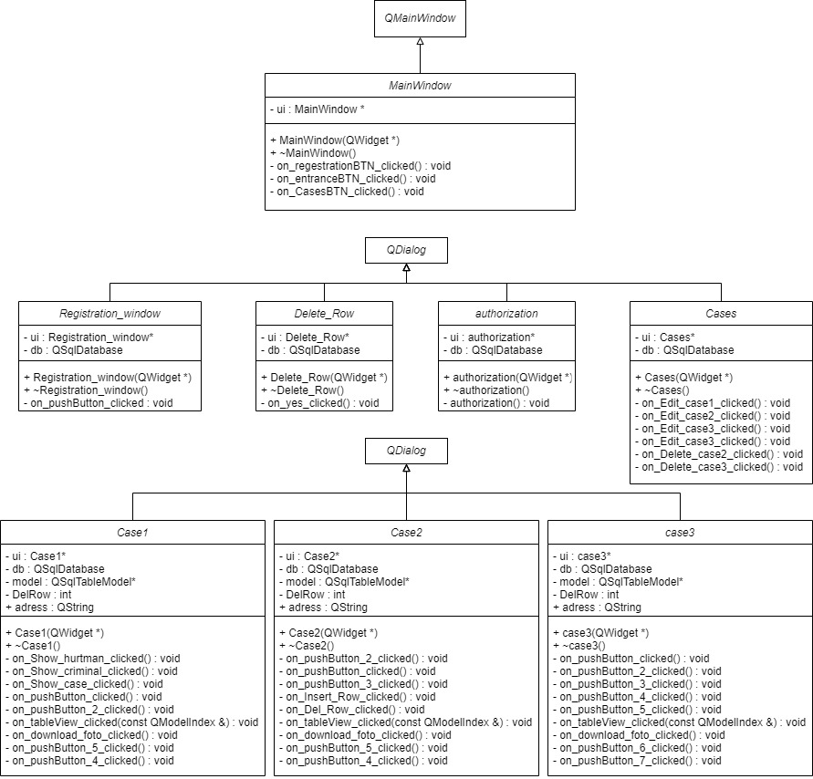

## Скриншоты работы программы

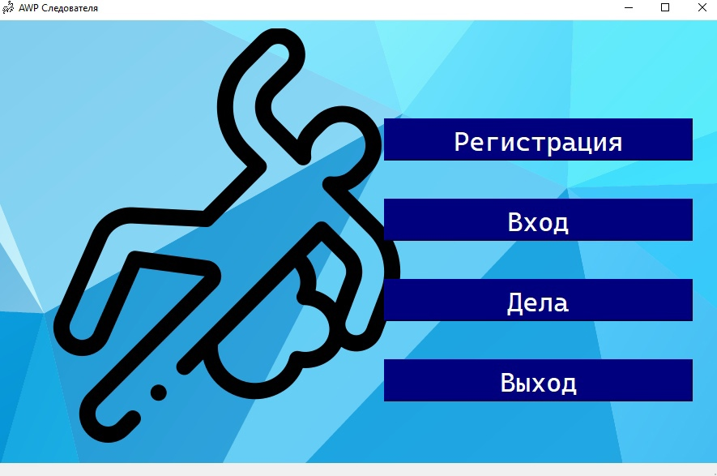
Рис. 1 - Окно входа в систему.

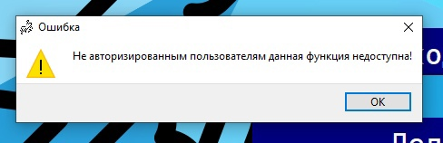
Рис. 2 - Ошибка доступа

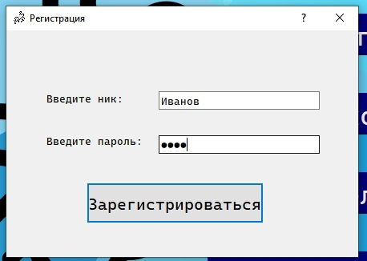
Рис. 3 - Регистрация нового пользователя

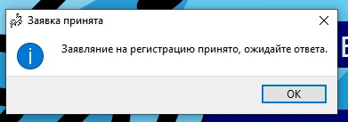
Рис. 4 - Сообщение о регистрации.

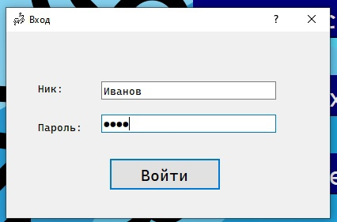
Рис. 5 - Вход незарегистрированного пользователя

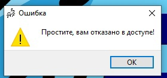
Рис. 6 - Ошибка незарегистрированного пользователя

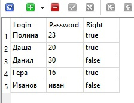
Рис. 7 - Список зарегистрированных пользователей в базе данных.

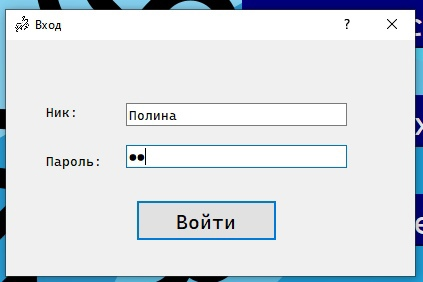
Рис. 8 - Вход зарегистрированного пользователя. 

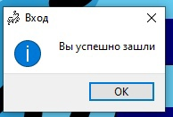
Рис. 9 - Сообщение об успешном входе 

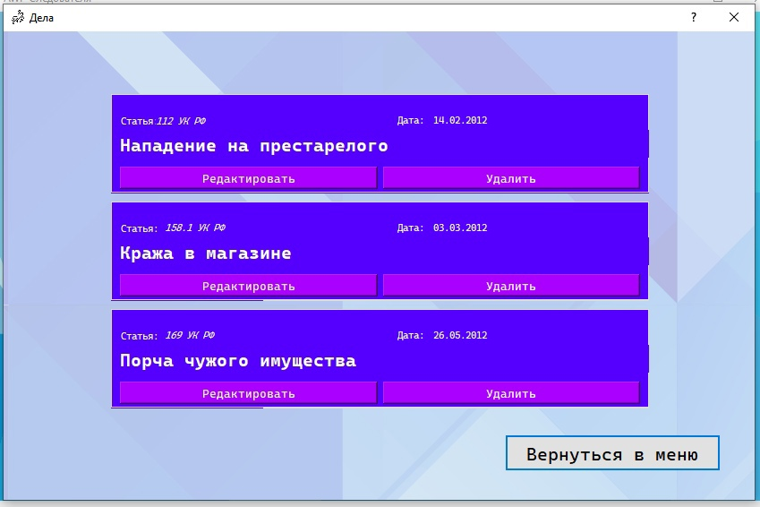
Рис. 10 - Окно с делами.

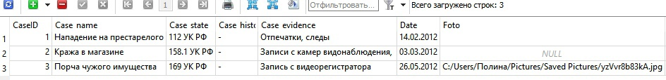
Рис. 11 - База данных с делами.

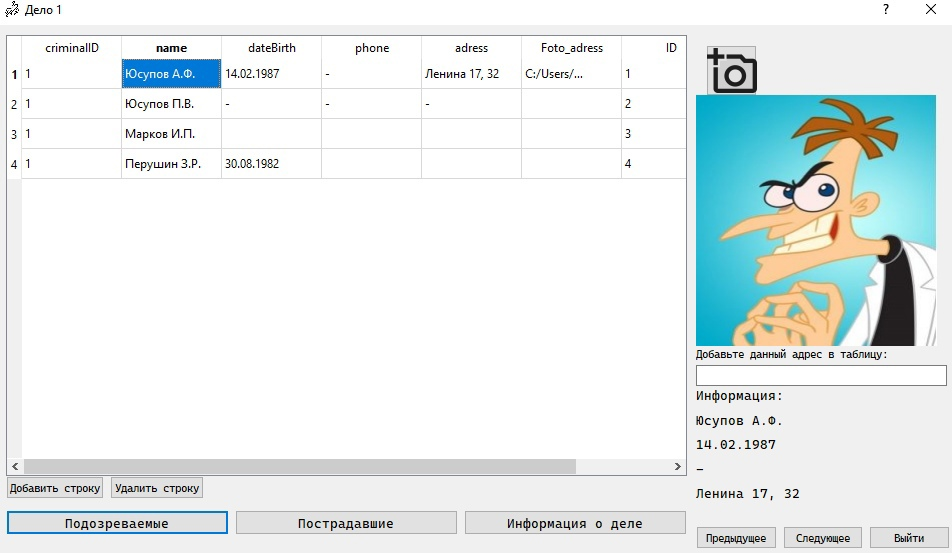
Рис. 12 - Таблица с подозреваемыми.

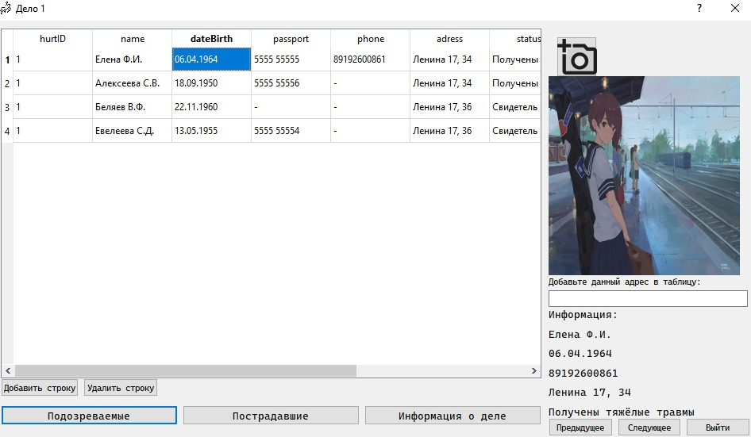
Рис. 13 - Таблица с пострадавшими. 

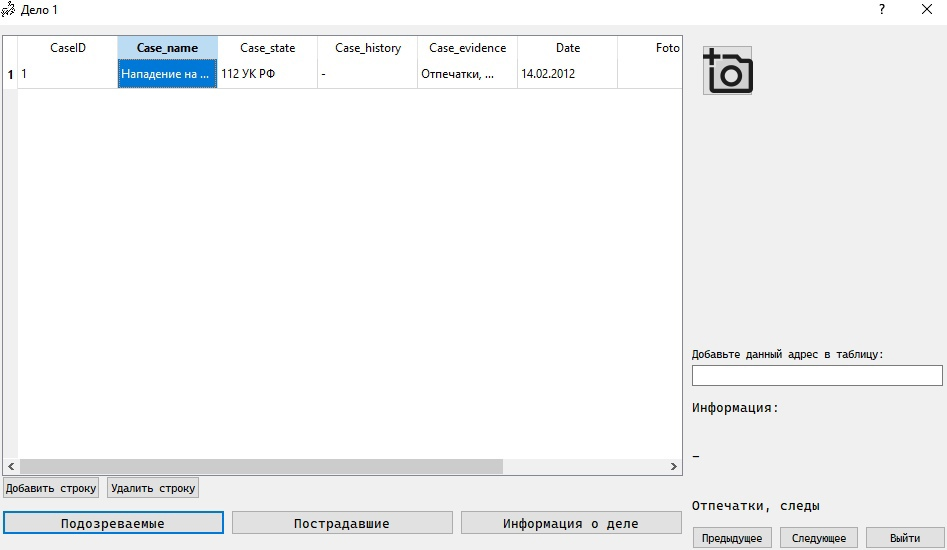
Рис. 14 - Таблица с делами

---
# Задача коммивояжёра 
## Постановка задачи
Реализовать алгоритм решения задачи коммивояжёра ```методом ветвей и границ```. Задача коммивояжера - это типичная NP-трудная задача оптимизации. _Дано_: множество городов, расстояние между каждой парой городов. _Нужно найти_: кратчайший маршрут, посещающий каждый город ровно один раз и возвращающийся в исходную точку. _Цель задачи_ - минимизировать общее пройденное расстояние. Главная сложность заключается в большом количестве возможных решений (факториал от числа городов), которые нужно проверить. Приближенные решения, полученные с помощью эвристик, позволяют найти приемлемые, хотя и не оптимальные маршруты для больших наборов городов.

## Aнализ задачи
- Граф - это математическая структура, состоящая из вершин и ребер. Графы широко используются для моделирования различных объектов и отношений.
- Метод ветвей и границ ```(Branch and Bound)``` - один из наиболее эффективных подходов для решения задачи коммивояжера. Он работает следующим образом:
    - На каждом шаге берется вершина, еще не включенная в маршрут.
    - Рекурсивно генерируются подзадачи - по одной для каждого способа включения этой вершины в маршрут.
    - Каждой подзадаче соответствует верхняя граница - это расстояние до текущего момента плюс расстояние до ближайшей непосещенной вершины.
    - Если верхняя граница больше, чем длина лучшего найденного решения, то эту подзадачу пропускаем.
    - Подзадача, дающая оптимальное решение, продвигается вперед. Остальные отсекаются.
    - Алгоритм завершается, когда найден маршрут, проходящий через все вершины.
- Глубина рекурсии соответствует количеству вершин в графе. При каждой новой ветви вычисляется верхняя граница и принимается решение - ветвиться дальше или отсекать. Достоинства этого подхода:
    - Гарантированно находит оптимальное решение
    - Эффективнее "полного перебора", так как отсекаются подзадачи, несущие оптимальное решение
    - Позволяет находить хорошие решения даже на ранних этапах
- Недостатки:
    - В худшем случае потребует перебора всех вариантов, как "полный перебор"
    - Требует хорошей верхней границы, чтобы быстро отсеивать большое число подзадач

Задача сводится к эффективному определению верхней границы для отсеивания подзадач и хорошей стратегии выбора следующей вершины.
- Для визуализации графа были использованы следующие классы ```Qt```:
    - ```QPainter``` - это класс ```QT```, предназначенный для рисования графики в виджетах. С его помощью можно рисовать простые и сложные геометрические фигуры, текст, изображения и многое другое. Основные возможности ```QPainter```:
        - Рисование линий, прямоугольников, окружностей и других геометрических фигур.
        - Заливка фигур цветом и градиентом.
        - Использование кистей и перьев с разными стилями для рисования.
        - Рисование текста с возможностью задавать шрифт, размер, цвет и другие параметры.
        - Отображение растровых изображений.
        - Выполнение геометрических преобразований: поворот, масштабирование, сдвиг и др.
        - Рисование в памяти или непосредственно на виджете.
        - Поддержка альфа-канала для прозрачности.
        - Возможность использования различных типов рисования: пиксельное, OpenGL и др.
    - ```QTableWidget``` - виджет таблицы в библиотеке ```QT```, который представляет данные в табличном формате и позволяет редактировать их. Он предоставляет готовый интерфейс для взаимодействия с таблицей данных. Основные возможности ```QTableWidget```:
      - Возможность редактирования ячеек прямо в виджете.
      - Автоподбор размера столбцов по содержимому.
      - Горизонтальная и вертикальная прокрутка.
      - Выделение строк и столбцов.
      - Встроенная сортировка по столбцам по возрастанию/убыванию.
      - Модель/представление данных - тесная интеграция с моделью ```QTableWidget```.
      - Возможность задавать различные типы данных для ячеек.
      - Встроенные делегаты (делегаты редактирования) для разных типов.
      - Сигналы и слоты для реагирования на действия пользователя.

## UML-диаграмма


## Скриншоты работы программы

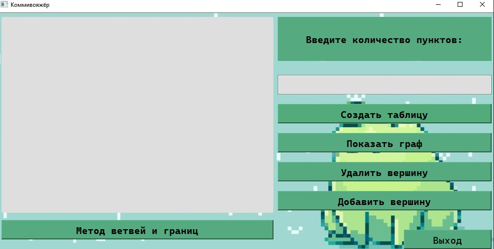
Рис. 1 - Окно задачи коммивояжёра.

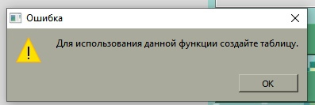
Рис. 2 - Ошибка несозданной таблицы смежности.

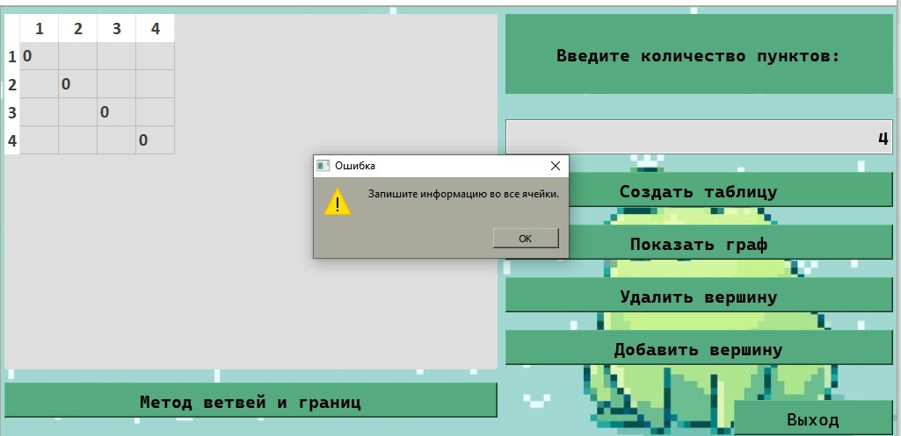
Рис. 3 - Ошибка незаполненной таблицы смежности.

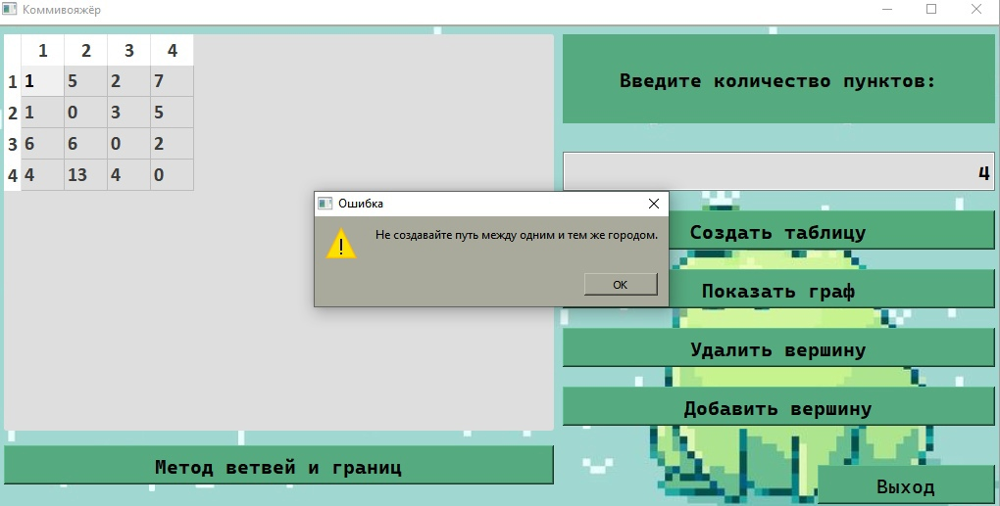
Рис. 4 - Ошибка неправильно заполненной таблицы смежности. 

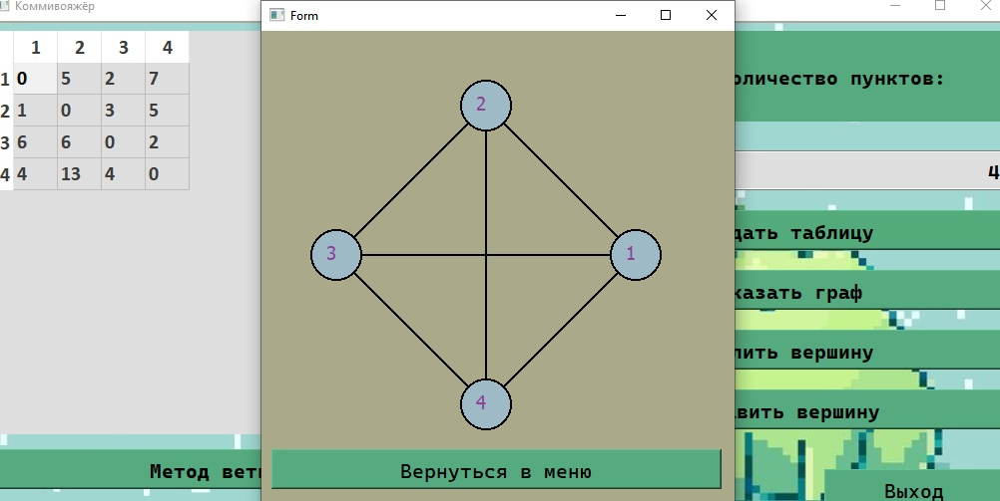
Рис. 5 - Граф по таблице смежности.

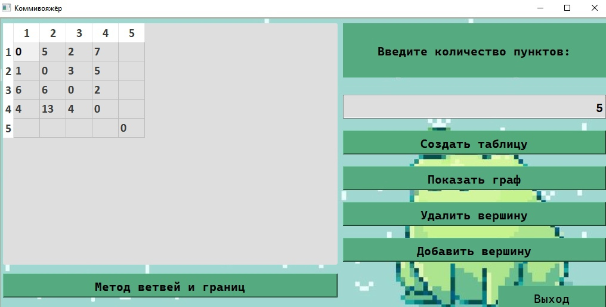
Рис. 6 - Добавление новой вершины.

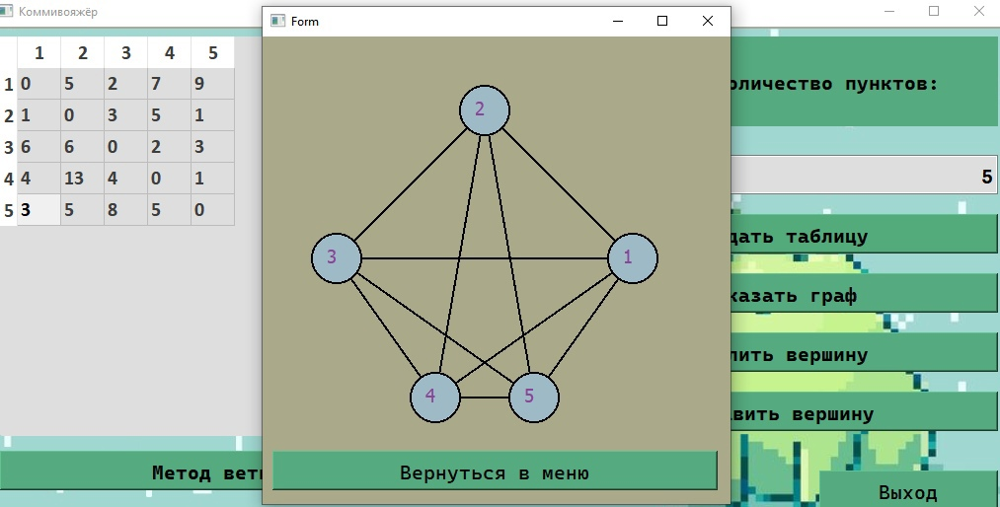
Рис. 7 - Новый граф по таблице смежности.

Рис. 8 - Решение задачи коммивояжёра.
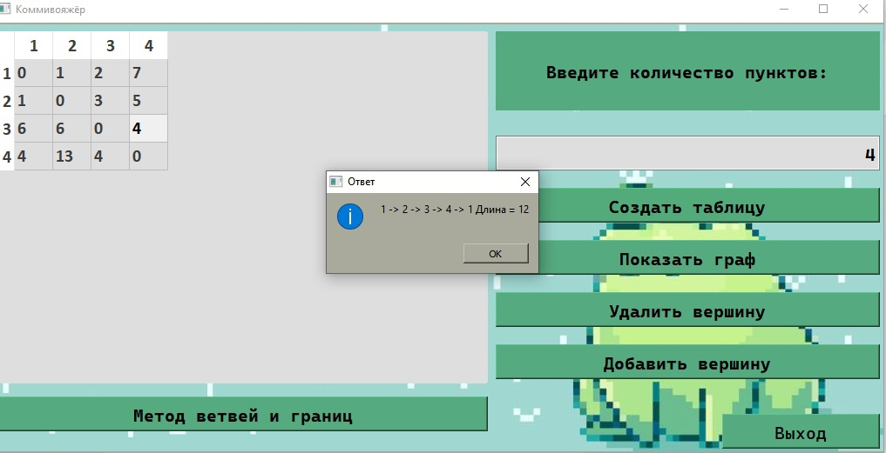


